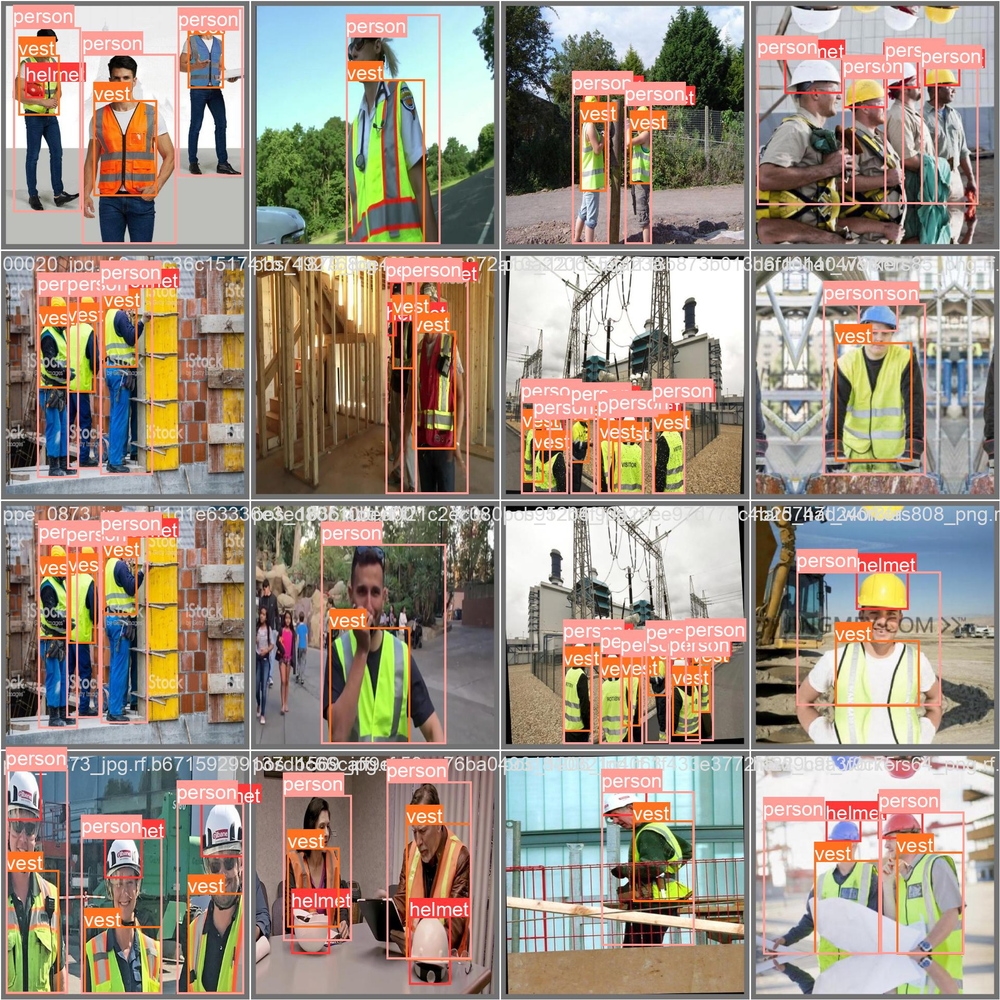
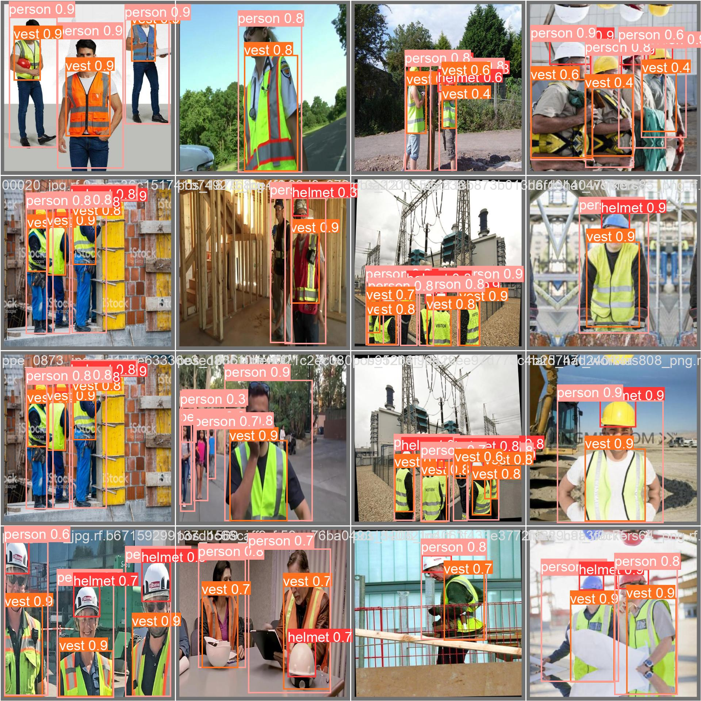

# Object-Detection-Yolov8
PPE detection using Yolov8

## In this project, we will learn:
1. Install Yolov8
2. Using a pre-trained model to predict objects in a given image
3. Train Yolov8 on a customized dataset
4. Assessing the results using object detection metrics

## Results
<!--  -->

  
  

  Figure 1: Prediction from the model on the PPE dataset

### [PPE dataset](https://universe.roboflow.com/team31/ppe-detection-83wpd/dataset/2#) [Roboflow](https://universe.roboflow.com/)
